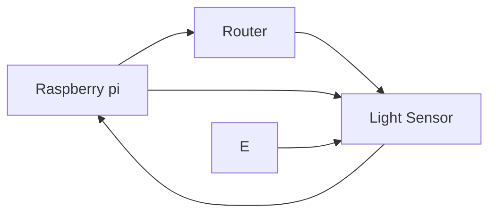
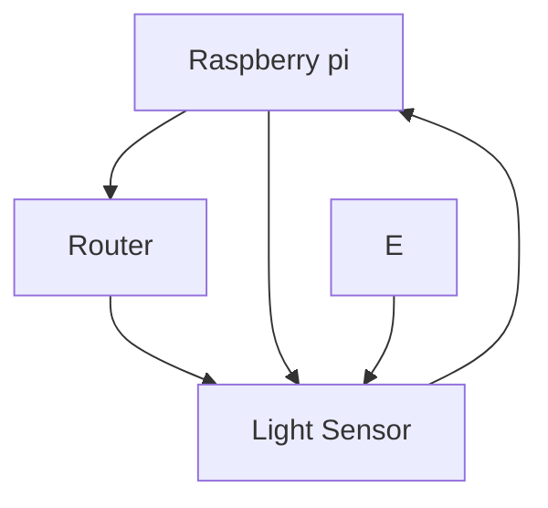

# EGL315-ayt

## Name
Halifi Wee

*Halifi*

**Halifi**

***Halifi***

## School
There are two Options to inset code 

### Code Block
```
I am at Nanyang Polytechnic
Block S
Room 540
```
## Code Line
`sudo raspi-config`

This is happy tree friends


## Block Diagram

Left to Right

Top Down


